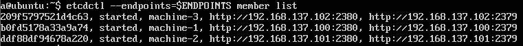
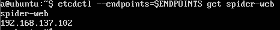
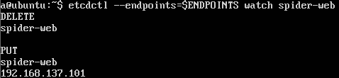

# spider-web-etcd-demo
将spider-web注册到etcd

 

* ### 运  行：
#### 1.安装[etcd](https://github.com/coreos/etcd)，模仿[官方demo](https://github.com/coreos/etcd/blob/master/Documentation/demo.md)配置，下面是我虚拟机(Ubuntu16.04)的配置：
<pre><code>
#Run this on all machine:

TOKEN=token-01
CLUSTER_STATE=new
NAME_1=machine-1
NAME_2=machine-2
NAME_3=machine-3
HOST_1=192.168.137.100
HOST_2=192.168.137.101
HOST_3=192.168.137.102
CLUSTER=${NAME_1}=http://${HOST_1}:2380,${NAME_2}=http://${HOST_2}:2380,${NAME_3}=http://${HOST_3}:2380

#Run this on each machine:

# For machine 1
THIS_NAME=${NAME_1}
THIS_IP=${HOST_1}
/opt/etcd/etcd --data-dir=data.etcd --name ${THIS_NAME} --initial-advertise-peer-urls http://${THIS_IP}:2380 --listen-peer-urls http://${THIS_IP}:2380 --advertise-client-urls http://${THIS_IP}:2379 --listen-client-urls http://${THIS_IP}:2379 --initial-cluster ${CLUSTER} --initial-cluster-state ${CLUSTER_STATE} --initial-cluster-token ${TOKEN}

# For machine 2
THIS_NAME=${NAME_2}
THIS_IP=${HOST_2}
/opt/etcd/etcd --data-dir=data.etcd --name ${THIS_NAME} --initial-advertise-peer-urls http://${THIS_IP}:2380 --listen-peer-urls http://${THIS_IP}:2380 --advertise-client-urls http://${THIS_IP}:2379 --listen-client-urls http://${THIS_IP}:2379 --initial-cluster ${CLUSTER} --initial-cluster-state ${CLUSTER_STATE} --initial-cluster-token ${TOKEN}

# For machine 3
THIS_NAME=${NAME_3}
THIS_IP=${HOST_3}
/opt/etcd/etcd --data-dir=data.etcd --name ${THIS_NAME} --initial-advertise-peer-urls http://${THIS_IP}:2380 --listen-peer-urls http://${THIS_IP}:2380 --advertise-client-urls http://${THIS_IP}:2379 --listen-client-urls http://${THIS_IP}:2379 --initial-cluster ${CLUSTER} --initial-cluster-state ${CLUSTER_STATE} --initial-cluster-token ${TOKEN}

# 另开一个终端，配置etcdctl所需的一些配置
export ETCDCTL_API=3
HOST_1=192.168.137.100
HOST_2=192.168.137.101
HOST_3=192.168.137.102

# Use this to check etcd member
ENDPOINTS=$HOST_1:2379,$HOST_2:2379,$HOST_3:2379
/opt/etcd/etcdctl --endpoints=$ENDPOINTS member list

</code></pre>

-------------------------------------------------------------------------------------------------------------------
#### 2.将spider-web中的com.spider.utils.RegisterOnEtcd类中所提到的参数和进行修改,并打包为war<pre><code>mvn clean package)</code></pre>
-------------------------------------------------------------------------------------------------------------------
#### 3.拷贝到虚拟机,运行<pre><code>java -jar spider-web-1.0-SNAPSHOT.war</code></pre>
-------------------------------------------------------------------------------------------------------------------
#### 4.用<pre><code>/opt/etcd/etcdctl --endpoints=$ENDPOINTS get spider-web</code></pre>可以看到当前是哪个结点的服务注册到etcd。

-------------------------------------------------------------------------------------------------------------------
#### 5.用<pre><code>/opt/etcd/etcdctl --endpoints=$ENDPOINTS watch spider-web</code></pre>监视key的变化，并关掉正在运行的虚拟机。

-------------------------------------------------------------------------------------------------------------------

